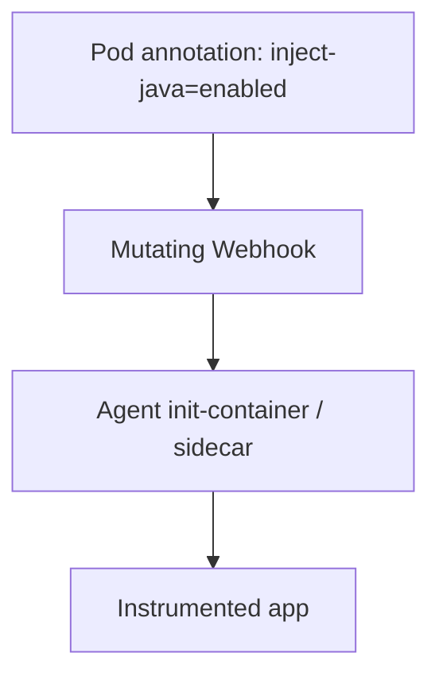

# Auto-Instrumentation on Kubernetes

## What It Is
The Operator **automatically injects** language agents (Java/Python/Node/.NET) into application pods via an `Instrumentation` CR and pod annotations — zero code change.

## Why It Exists
Manual agent config per deployment is error-prone; injection standardizes instrumentation across all workloads.

## How It Works


## Annotation Examples
```yaml
metadata:
  annotations:
    instrumentation.opentelemetry.io/inject-java: "default"
    instrumentation.opentelemetry.io/inject-python: "default"
    instrumentation.opentelemetry.io/inject-nodejs: "default"
    instrumentation.opentelemetry.io/inject-dotnet: "default"
```

## When to Use It
- Standardize instrumentation org-wide
- Fast onboarding of many services

## Best Practices
- Set a shared `Instrumentation` CR
- Pin agent versions in the CR
- Validate injection (check init container started)

## Common Issues & Solutions
| Issue | Fix |
|-------|-----|
| Agent not injected | Check annotation + webhook running |
| Conflict with other APM | Remove the other agent |

## Related Concepts
- [Instrumentation CRDs](otel-crds.md)
- [Operator](operator.md)
- [Auto / Zero-Code](../08-instrumentation/auto-zero-code.md)
