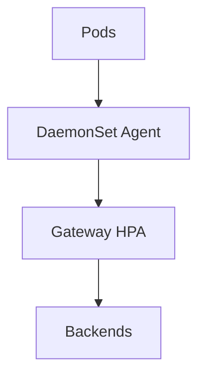

# Kubernetes Best Practices

## What It Is
Production guidance for running OpenTelemetry on Kubernetes reliably and cost-effectively.

## Why It Exists
K8s OTel has many moving parts; a clear pattern prevents dropped data and runaway cost.

## Recommended Topology

## Recommendations
- **Two tiers**: DaemonSet agent (light) + Deployment gateway (heavy)
- Always: `memory_limiter` (first) + `batch` + `k8sattributes`
- **Tail sampling** at the gateway; keep 100% errors
- HPA the gateway on CPU/queue size
- Secure agent→gateway with mTLS/token
- Manage config in Git (Operator CR / Helm values)
- Use `health_check` for liveness/readiness probes
- Monitor the Collector's own metrics

## Common Pitfalls
| Pitfall | Fix |
|---------|-----|
| Dropped spans | Add `memory_limiter`, scale gateway |
| Broken traces | Ensure injection/propagation |
| Cost explosion | Tail sampling + drop debug logs |

## Related Concepts
- [Operator](operator.md)
- [DaemonSet Agent](daemonset-agent.md)
- [Gateway](gateway.md)
- [Scaling](../06-collector/scaling.md)
