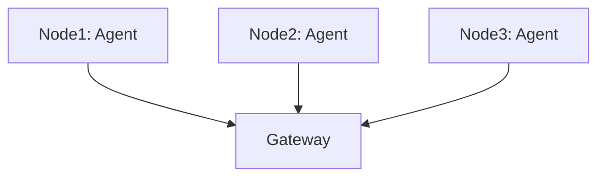

# DaemonSet Agent

## What It Is
The **DaemonSet agent** runs one Collector pod **per node**, collecting node-local telemetry (host metrics, container logs, app OTLP) and forwarding to the gateway.

## Why It Exists
A node-local agent minimizes network hops, tails node logs, and enriches with `k8sattributes` before forwarding.

## Architecture


## Responsibilities
- Receive OTLP from apps on localhost
- `hostmetrics` + `k8sattributes`
- Tail container logs (`filelog`/`container` receiver)
- Forward to gateway (OTLP)

## When to Use It
- Almost every K8s OTel deployment
- Pair with a gateway

## Code Example (Operator)
```yaml
spec:
  mode: daemonset
  config: |
    receivers: { otlp: { protocols: { grpc: { endpoint: 0.0.0.0:4317 } } },
                 hostmetrics: { scrapers: { cpu: {}, memory: {} } } }
    processors: { batch: {}, k8sattributes: {} }
    exporters: { otlp/gateway: { endpoint: otel-gateway:4317 } }
```

## Best Practices
- Add `memory_limiter` + `batch` + `k8sattributes`
- Restrict resource limits per node
- Don't run heavy processors here (leave to gateway)

## Related Concepts
- [Gateway](gateway.md)
- [Agent vs Gateway](../02-architecture/agent-vs-gateway.md)
