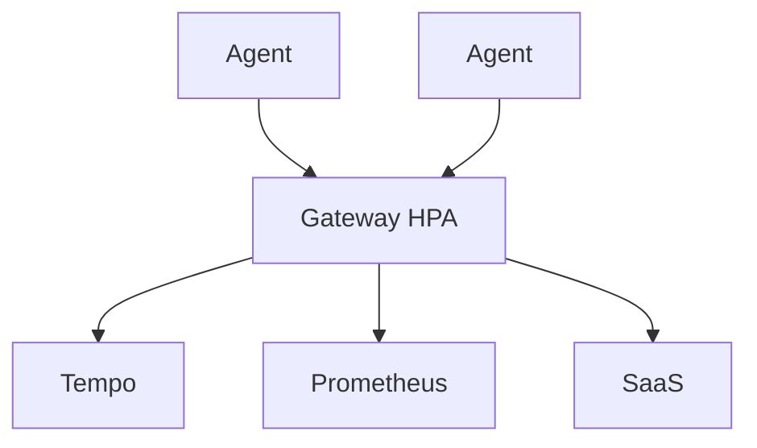

# Gateway (Kubernetes)

## What It Is
The **gateway** is a centralized Collector **Deployment** (often HPA-scaled) that receives from agents and exports to backends with heavy processing (tail sampling, routing).

## Why It Exists
Centralizing export/auth/routing at the gateway decouples many agents from many backends and enables smart sampling.

## Architecture


## Responsibilities
- Receive OTLP from agents
- `tail_sampling`, `transform`, `resource`
- Fan-out exporters to backends
- Authenticate agents (mTLS/token)

## When to Use It
- Multi-service / production scale
- Need tail sampling or multi-backend routing

## Code Example
```yaml
spec:
  mode: deployment
  replicas: 3
  config: |
    processors:
      tail_sampling:
        policies:
          - { name: errors, type: status_code, status_code: { status_codes: [ERROR] } }
          - { name: prob, type: probabilistic, probabilistic: { sampling_percentage: 10 } }
```

## Best Practices
- HPA on CPU/queue size
- Put `tail_sampling` only here (needs whole trace)
- Secure agent→gateway transport

## Related Concepts
- [DaemonSet Agent](daemonset-agent.md)
- [Sampling](../02-architecture/sampling.md)
