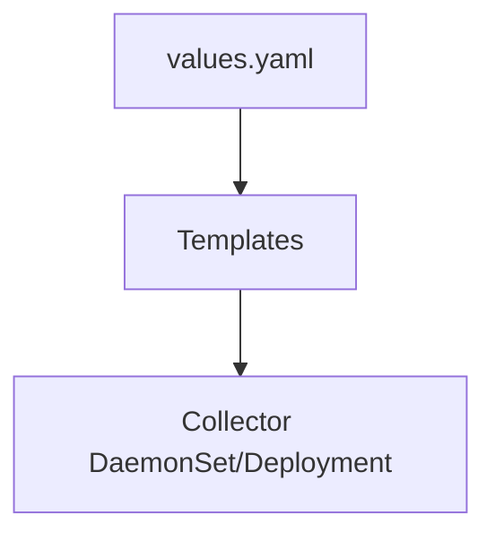

# Helm Charts

## What It Is
Official **Helm charts** (`opentelemetry-helm/opentelemetry-collector`) deploy the Collector on Kubernetes with templated values.

## Why It Exists
Helm is the common K8s packaging; charts make Collector deployment repeatable and configurable via values.

## Key Charts
| Chart | Purpose |
|-------|---------|
| `opentelemetry-collector` | Core collector (single mode) |
| `opentelemetry-collector-kubernetes` | K8s-focused with agent+gateway |

## Architecture


## When to Use It
- Non-Operator deployments
- GitOps-driven config

## Code Example
```bash
helm repo add open-telemetry https://open-telemetry.github.io/opentelemetry-helm-charts
helm install otel open-telemetry/opentelemetry-collector \
  --set mode=deployment \
  --set config.receivers.otlp.protocols.grpc={}
```

## Best Practices
- Pin chart version
- Use `mode: daemonset` for agents, `deployment` for gateway
- Manage config via `values.yaml` in Git

## Related Concepts
- [Operator](operator.md)
- [DaemonSet Agent](daemonset-agent.md)
