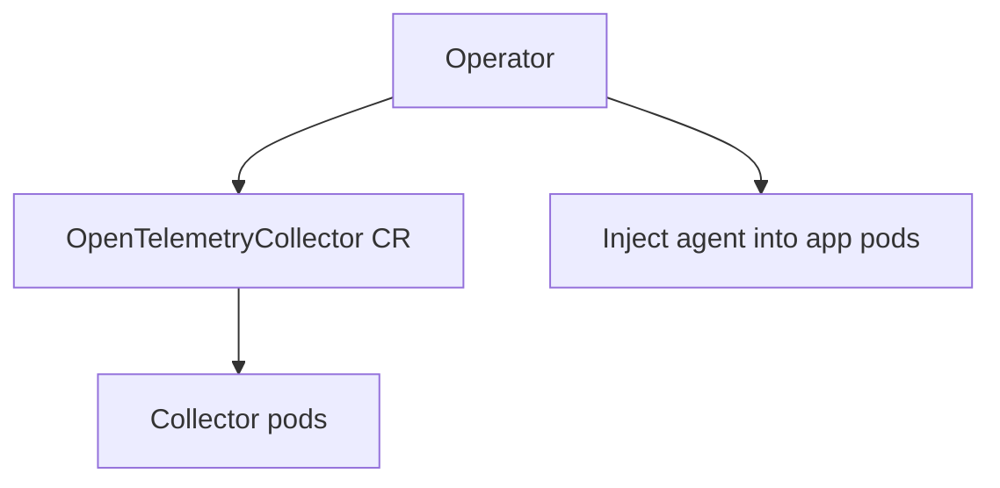

# OpenTelemetry Operator

## What It Is
The **OpenTelemetry Operator** is a Kubernetes operator that manages Collector instances and **auto-injects** instrumentation via custom resources (CRDs).

## Why It Exists
Kubernetes needs declarative, reconciled management of telemetry components and consistent, zero-touch instrumentation injection.

## What It Provides
| Capability | Detail |
|------------|--------|
| `OpenTelemetryCollector` CRD | Deploys Collector (daemonset/deployment/statefulset) |
| `Instrumentation` CRD | Defines SDK/agent config for injection |
| Webhook injection | Adds agent sidecar/init-container to pods |
| `OpAMP` support | Remote config management |

## Architecture


## When to Use It
- Kubernetes-native OTel management
- Consistent auto-instrumentation across teams

## Code Example
```yaml
apiVersion: opentelemetry.io/v1alpha1
kind: OpenTelemetryCollector
metadata: { name: gateway }
spec:
  mode: deployment
  config: |
    receivers: { otlp: { protocols: { grpc: {}, http: {} } } }
    exporters: { debug: {} }
    service: { pipelines: { traces: { receivers: [otlp], exporters: [debug] } } }
```

## Best Practices
- Run Operator in a dedicated namespace
- Use `Instrumentation` CR for org-wide defaults
- Separate agent (daemonset) and gateway (deployment)

## Related Concepts
- [Helm](helm.md)
- [Auto-Instrumentation K8s](auto-instrumentation-k8s.md)
- [OTel CRDs](otel-crds.md)
