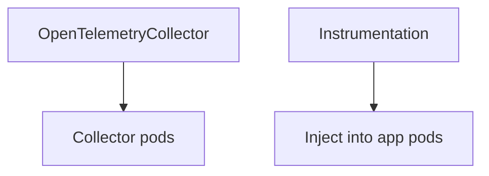

# OpenTelemetry CRDs

## What It Is
The Operator introduces **Custom Resource Definitions** to declare telemetry infrastructure declaratively: `OpenTelemetryCollector` and `Instrumentation`.

## Why It Exists
Kubernetes is CRD-driven; CRDs let you manage Collectors and instrumentation the same way as other K8s resources (GitOps-friendly).

## CRDs
| CRD | Purpose |
|-----|---------|
| `OpenTelemetryCollector` | Define a Collector (mode, config, replicas) |
| `Instrumentation` | Define SDK/agent config + language agents for injection |

## Architecture


## When to Use It
- Declarative, reconciled management
- Org-wide instrumentation defaults

## Code Example (Instrumentation CR)
```yaml
apiVersion: opentelemetry.io/v1alpha1
kind: Instrumentation
metadata: { name: default }
spec:
  exporter:
    endpoint: http://otel-gateway:4317
  java: { env: [{ name: OTEL_SERVICE_NAME, valueFrom: { fieldRef: { fieldPath: metadata.name } } }] }
```

## Best Practices
- One shared `Instrumentation` CR per environment
- Reference it via pod annotations
- Manage CRs in Git

## Related Concepts
- [Operator](operator.md)
- [Auto-Instrumentation K8s](auto-instrumentation-k8s.md)
