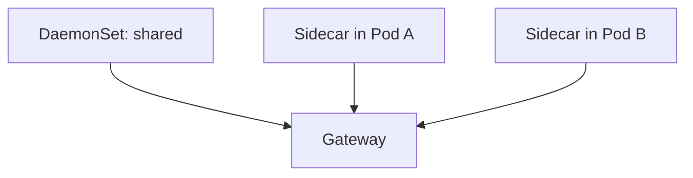

# Sidecar vs DaemonSet

## What It Is
The two main **Collector placement** options in Kubernetes: a **DaemonSet** (one per node) vs a **sidecar** (one per pod).

## Why It Exists
Placement affects cost, isolation, and operations. Choosing wrong leads to wasted resources or noisy-neighbor issues.

## Comparison
| Aspect | DaemonSet | Sidecar |
|--------|-----------|---------|
| Resource use | Shared per node | Per pod (more overhead) |
| Isolation | Weaker (multi-tenant) | Strong (per workload) |
| Log access | Easy (node) | Per pod |
| Tail sampling | At gateway | Per pod |
| Best for | Most clusters | Strict tenancy / edge |

## Architecture

## When to Use It
- **DaemonSet** for the vast majority
- **Sidecar** only for hard tenancy/security boundaries

## Best Practices
- Default to DaemonSet agent + Deployment gateway
- Reserve sidecars for compliance-critical workloads
- Right-size sidecar resources carefully

## Related Concepts
- [DaemonSet Agent](daemonset-agent.md)
- [Gateway](gateway.md)
- [Deployment Modes](../02-architecture/deployment-modes.md)
