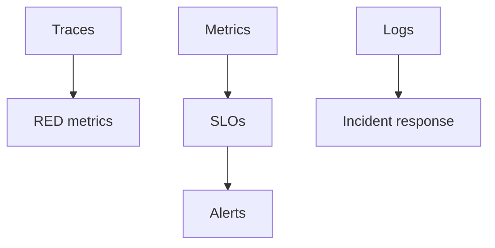

# 14 · Observability Practice

> Turning telemetry into **actionable reliability**: golden signals, the RED/USE methods, SLOs, alerting, cost control, and the OpenTelemetry demo.

## Topics in this section

| Document | Summary |
|----------|---------|
| [golden-signals.md](golden-signals.md) | Latency, traffic, errors, saturation |
| [red-use.md](red-use.md) | RED (requests) & USE (resources) methods |
| [slos.md](slos.md) | Service Level Objectives from OTel data |
| [alerting.md](alerting.md) | Alerting on telemetry |
| [cost.md](cost.md) | Controlling OTel cost/cardinality |
| [opentelemetry-demo.md](opentelemetry-demo.md) | The official demo app |
| [incident-response.md](incident-response.md) | Using OTel during incidents |

See the [main README](../README.md) for the full map.
