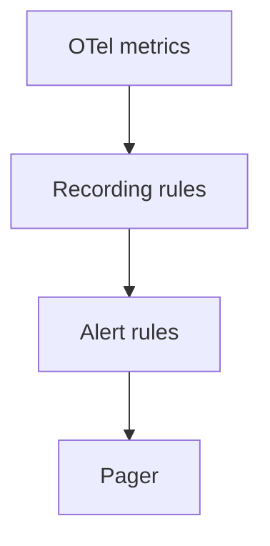

# Alerting

## What It Is
**Alerting** fires notifications when OTel-derived signals breach SLOs or show anomalies — without overwhelming on-call.

## Why It Exists
Telemetry is useless if nobody is paged when things break. Good alerting balances signal vs noise.

## Alert Sources from OTel
| Alert | Signal |
|-------|--------|
| High error rate | RED error counter |
| Latency SLO breach | Histogram p99 |
| Saturation | USE (`system.memory.usage`) |
| Collector dropping | `otelcol_*_dropped_*` |
| Trace errors | tail-sampled error spans |

## Architecture

## When to Use It
- Page on SLO burn rate, not every spike
- Warn on saturation trends

## Best Practices
- Alert on symptoms (user impact), not causes
- Use multi-window burn-rate alerts for SLOs
- Monitor the Collector itself (dropped data)

## Common Pitfalls
| Pitfall | Fix |
|---------|-----|
| Alert fatigue | Alert on SLO burn, not thresholds |
| Silent data loss | Alert on `dropped_*` metrics |

## Related Concepts
- [SLOs](slos.md)
- [Observability of Collector](../06-collector/observability-of-collector.md)
