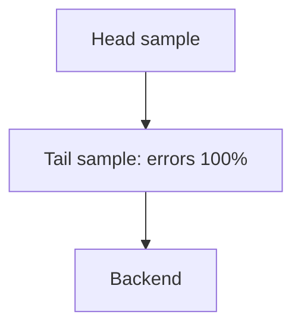

# Cost Control

## What It Is
Strategies to keep **OpenTelemetry data volume (and cost)** under control — sampling, cardinality management, and retention.

## Why It Exists
Telemetry cost scales with volume and cardinality; unmanaged OTel pipelines become expensive fast.

## Levers
| Lever | Effect |
|-------|--------|
| **Head sampling** (SDK) | Cuts ingest at source |
| **Tail sampling** (gateway) | Keep errors + sample rest |
| **Cardinality control** | Drop high-card attributes |
| **Log sampling** | Drop DEBUG in prod |
| **Retention tiers** | Short hot, long cold |

## Architecture

## When to Use It
- Always in production
- Revisit as traffic grows

## Best Practices
- Keep 100% of errors via tail sampling
- Drop user/request IDs from metrics (Views)
- Use the `attributes` processor to redact + reduce
- Monitor `otelcol_exporter_queue_size` / cost dashboards

## Related Concepts
- [Sampling](../02-architecture/sampling.md)
- [Views](../04-metrics/views.md)
- [Metric Streams](../04-metrics/metric-streams.md)
