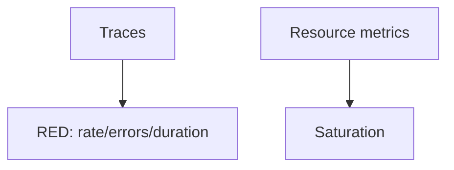

# Golden Signals

## What It Is
The **four golden signals** — **Latency, Traffic, Errors, Saturation** — are the minimal metrics every service should track.

## Why It Exists
They summarize user experience and system health; everything else is detail. OTel makes them easy via RED metrics from traces + resource metrics.

## The Four
| Signal | Question | OTel Source |
|--------|----------|-------------|
| **Latency** | How slow? | Histogram `http.server.duration` |
| **Traffic** | How much? | Counter requests/sec |
| **Errors** | How failing? | Error counter / span status |
| **Saturation** | How full? | CPU/mem/queue (USE) |

## Architecture

## When to Use It
- Baseline dashboards for every service
- Starting point for SLOs

## Best Practices
- Measure latency of **successful** vs **failed** separately
- Use histograms (percentiles), not averages
- Derive RED from spans via spanmetrics connector

## Related Concepts
- [RED/USE](red-use.md)
- [SLOs](slos.md)
- [SpanMetrics connector](../02-architecture/connectors.md)
