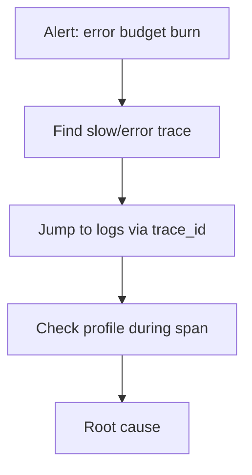

# Incident Response with OTel

## What It Is
Using OpenTelemetry telemetry **during incidents** to find root cause fast: from alert → trace → logs → profile.

## Why It Exists
Incidents are time-critical; correlated telemetry turns "where is the problem?" into a few clicks.

## Workflow

## Steps
1. **Alert** fires (SLO burn / saturation)
2. Open the **trace** for the affected request
3. **Correlate logs** via `trace_id`
4. Check **RED metrics** for the service
5. If CPU-bound, pull a **profile** for that window
6. Identify the faulty dependency/code

## When to Use It
- Every production incident
- Post-incident reviews (what telemetry was missing?)

## Best Practices
- Ensure trace_id correlation is wired before incidents
- Pre-build dashboards (golden signals per service)
- Practice with the OTel demo

## Related Concepts
- [Golden Signals](golden-signals.md)
- [Trace ID Correlation](../03-traces/trace-id-correlation.md)
- [Flamegraphs](../12-profiling/flamegraphs.md)
