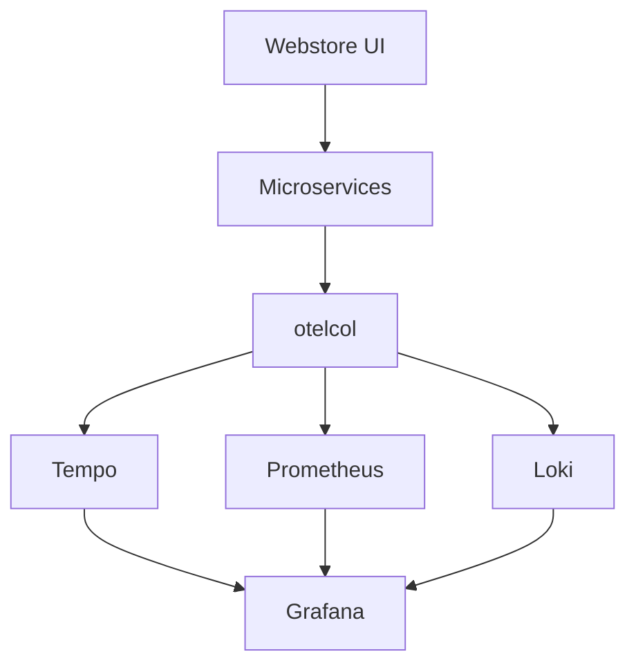

# OpenTelemetry Demo

## What It Is
The **OpenTelemetry Demo** (formerly Astronomy Shop) is an official, polyglot microservices app fully instrumented with OTel — a hands-on learning and testing environment.

## Why It Exists
Learning OTel is easier with a real, multi-language system that already emits traces/metrics/logs through a Collector to Tempo/Prometheus/Grafana.

## What It Includes
- ~10+ services in Go, Python, Java, JS, .NET, Rust, C++
- Frontend, cart, checkout, currency, recommendations, etc.
- Full OTel pipeline: SDKs → Collector → backends
- Load generator for realistic traffic

## Architecture


## When to Use It
- Learning OTel end-to-end
- Testing Collector configs, sampling, dashboards
- Vendor evaluation / PoC

## Code Example
```bash
git clone https://github.com/open-telemetry/opentelemetry-demo
docker compose up   # or kubectl via helm
```

## Best Practices
- Use it as a sandbox for Collector pipeline changes
- Compare backends by pointing exporters differently

## Related Concepts
- [Collector](../06-collector/README.md)
- [Kubernetes Deployment](../13-kubernetes-deployment/README.md)
