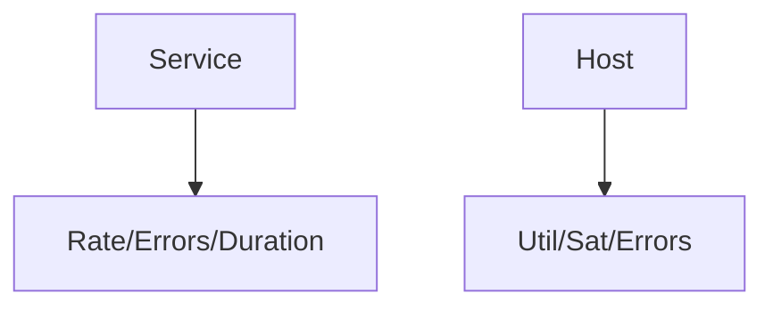

# RED & USE Methods

## What It Is
Two complementary observability methods:
- **RED** (for request-driven services): **Rate, Errors, Duration**
- **USE** (for resources): **Utilization, Saturation, Errors**

## Why It Exists
They give a checklist so you instrument what matters and nothing more.

## RED
| Metric | OTel |
|--------|------|
| Rate | Counter `requests_total` |
| Errors | Counter `requests_errors_total` |
| Duration | Histogram `http.server.duration` |

## USE
| Metric | OTel |
|--------|------|
| Utilization | `system.cpu.usage`, `system.memory.usage` |
| Saturation | queue length, `system.pressure` |
| Errors | device/disk errors |

## Architecture

## When to Use It
- RED for every microservice
- USE for every host/container/node

## Best Practices
- Generate RED from traces (spanmetrics) for free
- Use histograms for duration
- Alert on error rate and saturation

## Related Concepts
- [Golden Signals](golden-signals.md)
- [Metrics](../04-metrics/README.md)
- [System Conventions](../11-semantic-conventions/system.md)
