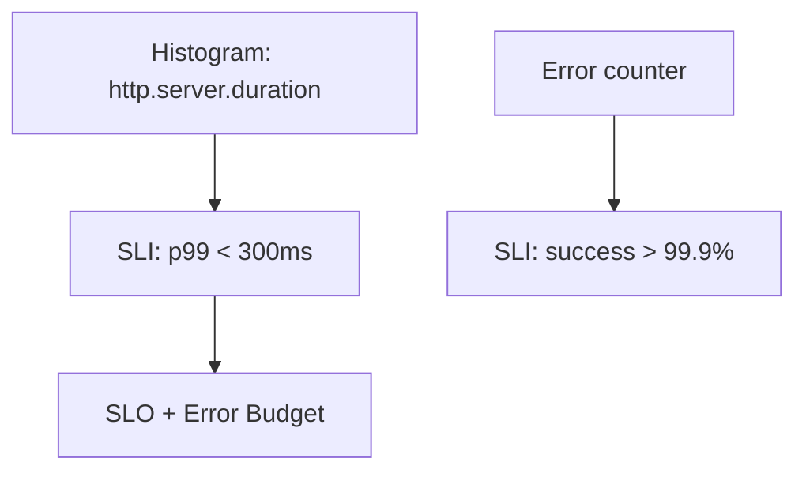

# SLOs

## What It Is
A **Service Level Objective (SLO)** is a **target reliability** (e.g., "99.9% of requests succeed in <300ms over 30 days"), derived from OTel metrics.

## Why It Exists
SLOs turn telemetry into a reliability contract and drive alerting/error budgets instead of noisy thresholds.

## Building from OTel


- **SLI** = the measured ratio (from OTel metrics)
- **SLO** = the target (e.g., 99.9%)
- **Error budget** = 1 − SLO

## When to Use It
- Define per critical service
- Drive alerts from burn rate, not raw thresholds

## Code Example (Prometheus/OTel)
```
# SLI: success ratio from OTel counters
sum(rate(http_requests_total{status!~"5.."}[5m]))
 /
sum(rate(http_requests_total[5m]))
```

## Best Practices
- Base SLIs on RED metrics
- Alert on multi-window burn rate
- Review error budgets regularly

## Related Concepts
- [Golden Signals](golden-signals.md)
- [Alerting](alerting.md)
- [Prometheus](../10-exporters-backends/prometheus.md)
