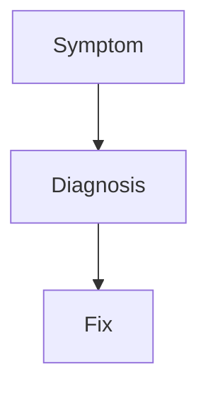

# 15 · Troubleshooting

> A practical runbook for when OpenTelemetry **doesn't do what you expect**: missing spans, dropped data, OOM, sampling loss, and Collector errors.

## Topics in this section

| Document | Summary |
|----------|---------|
| [missing-spans.md](missing-spans.md) | Traces not appearing / broken |
| [dropped-data.md](dropped-data.md) | Exporter/queue drops |
| [oom.md](oom.md) | Collector or SDK out-of-memory |
| [sampling-loss.md](sampling-loss.md) | Expected data missing due to sampling |
| [collector-errors.md](collector-errors.md) | Pipeline / config errors |
| [propagation-gaps.md](propagation-gaps.md) | Broken cross-service context |
| [runbooks.md](runbooks.md) | End-to-end diagnostic flow |

See the [main README](../README.md) for the full map.
