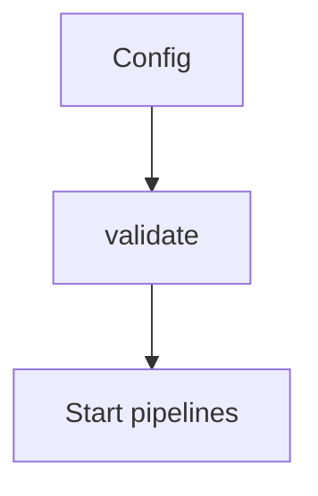

# Collector Errors

## Symptom
The Collector fails to start, a pipeline won't load, or a component errors.

## Likely Causes & Fixes
| Cause | Fix |
|-------|-----|
| Unknown component referenced | Check spelling in `service.pipelines` |
| Missing processor in pipeline | Add it under `processors:` |
| Invalid YAML | Run `otelcol --config=... validate` |
| Exporter auth failure | Check credentials/env vars |
| Receiver port conflict | Use distinct ports per receiver |
| Extension not enabled | List it under `service.extensions` |

## Validate Config
```bash
otelcol --config=collector.yaml validate
```

## Architecture


## Best Practices
- Validate config in CI before deploy
- Keep components minimal (only what's used)
- Use env substitution for secrets

## Related Concepts
- [Config](../06-collector/config.md)
- [Dropped Data](dropped-data.md)
