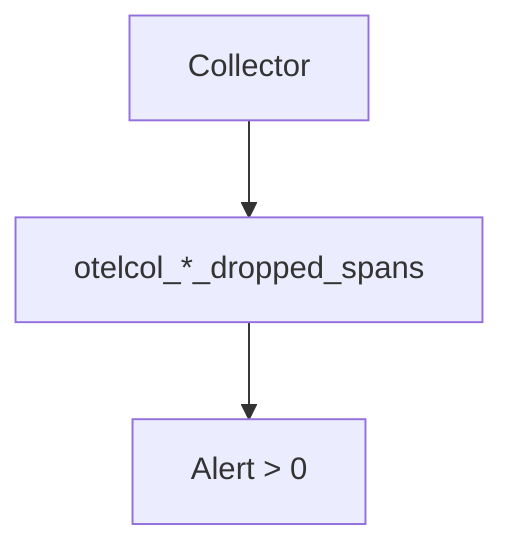

# Dropped Data

## Symptom
Telemetry is being dropped — gaps in metrics, missing spans/logs at volume.

## Likely Causes & Fixes
| Cause | Fix |
|-------|-----|
| Collector OOM | Add/raise `memory_limiter` |
| Exporter backend down | Check `otelcol_exporter_send_failed_*`; add retry/queue |
| Queue overflow | Increase `sending_queue` size |
| `memory_limiter` limit hit | Increase limit or reduce ingest |
| Processor dropping | Check `otelcol_processor_dropped_*` |

## Monitoring

## Best Practices
- Always include `memory_limiter` (first) + `batch`
- Alert on `*_dropped_*` and `*_send_failed_*`
- Scale gateway when queue grows persistently

## Related Concepts
- [OOM](oom.md)
- [Collector Errors](collector-errors.md)
- [Scaling](../06-collector/scaling.md)
