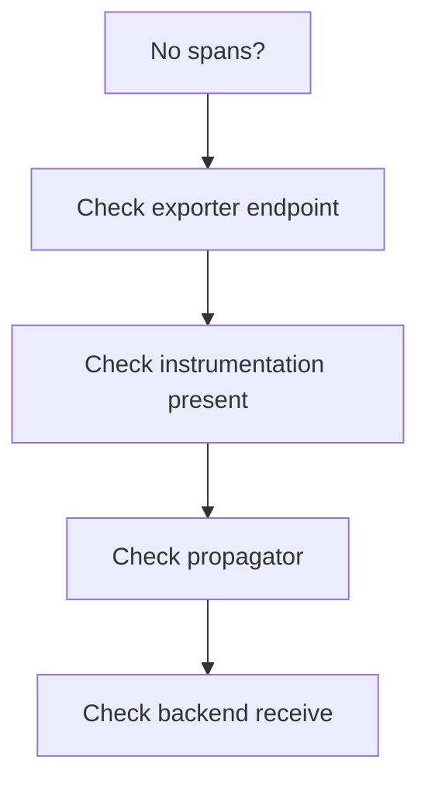

# Missing Spans / Traces

## Symptom
Spans don't appear in the backend, or traces are broken (flat / orphaned).

## Likely Causes & Fixes
| Cause | Fix |
|-------|-----|
| App not exporting (wrong endpoint) | Set `OTEL_EXPORTER_OTLP_ENDPOINT` correctly (`:4317` gRPC / `:4318` HTTP) |
| No instrumentation | Add auto-instrumentation or library instrumentation |
| Propagator not set | Ensure W3C Trace Context propagator is configured |
| Context lost in async | Pass context explicitly through callbacks |
| SDK not initialized | Initialize TracerProvider at startup |
| Exporter failing silently | Check `otelcol_exporter_send_failed_spans` |

## Diagnostic Flow

## Best Practices
- Use the `debug` exporter to confirm spans at the Collector
- Verify the agent→gateway→backend chain with `debug`
- Confirm `service.name` is set

## Related Concepts
- [Collector Errors](collector-errors.md)
- [Propagation Gaps](propagation-gaps.md)
- [Exporters (arch)](../02-architecture/exporters.md)
