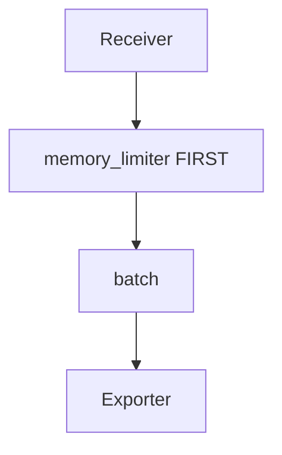

# Out of Memory (OOM)

## Symptom
The Collector (or SDK) is OOM-killed, or pods restart with OOM.

## Likely Causes & Fixes
| Cause | Fix |
|-------|-----|
| No `memory_limiter` | Add it as the **first** processor |
| Too much unbatched data | Increase `batch` timeout/size |
| High cardinality | Drop high-card attributes (Views/processor) |
| Insufficient limits | Raise K8s memory `limit` |
| Tail sampling without `file_storage` | Persist decisions; bound memory |

## Architecture

## Best Practices
- `memory_limiter` must be first in every pipeline
- Set `limit_mib` below the container limit (leave headroom)
- Use `check_interval` ~1s

## Related Concepts
- [Dropped Data](dropped-data.md)
- [Processors (arch)](../02-architecture/processors.md)
- [Sampling](../02-architecture/sampling.md)
