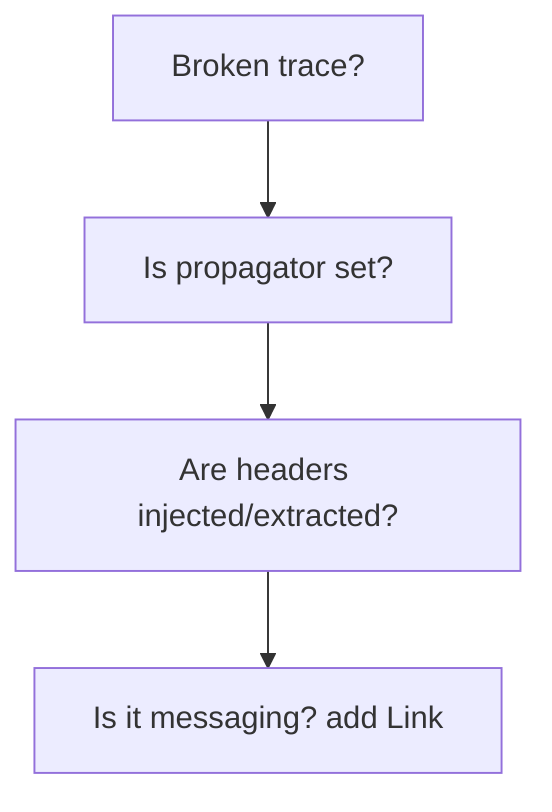

# Propagation Gaps

## Symptom
Traces break across services — orphan spans, new trace IDs at each hop.

## Likely Causes & Fixes
| Cause | Fix |
|-------|-----|
| Propagator not configured | Set W3C Trace Context propagator |
| Custom transport not injecting | Manually `inject`/`extract` headers |
| Messaging without Links | Add Link from consumer to producer |
| Another APM overwriting headers | Remove conflicting agent |
| Async boundary drops context | Pass context through callbacks |

## Diagnostic Flow

## Best Practices
- Use the standard W3C propagator everywhere
- Verify headers on the wire (proxy/logs)
- For messaging, also add a Link

## Related Concepts
- [Missing Spans](missing-spans.md)
- [Propagators](../07-context-propagation/propagators.md)
- [Cross-Process](../07-context-propagation/cross-process.md)
