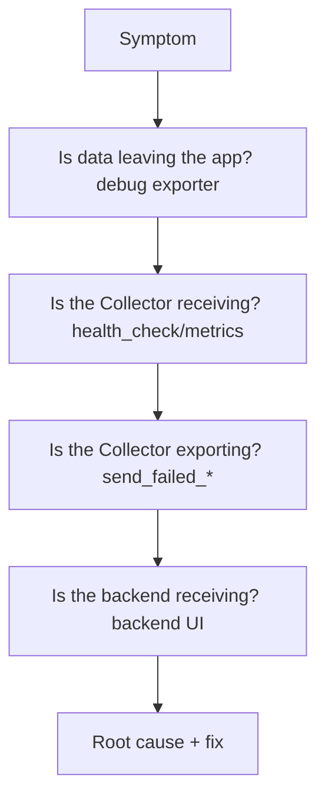

# Diagnostic Runbooks

## What It Is
An **end-to-end diagnostic flow** for OpenTelemetry issues, from symptom to fix.

## Why It Exists
When telemetry breaks, you need a fast, repeatable path to root cause rather than guessing.

## The Flow


## Quick Commands
```bash
# Confirm Collector health
curl http://collector:13133/healthz

# Confirm internal metrics
curl http://collector:8888/metrics | grep dropped

# Local debug export from app
OTEL_EXPORTER_OTLP_ENDPOINT=... OTEL_TRACES_EXPORTER=debug python app.py
```

## Best Practices
- Start at the source, move outward
- Use `debug` exporter to isolate tiers
- Monitor the Collector's own metrics proactively

## Related Concepts
- [Missing Spans](missing-spans.md)
- [Dropped Data](dropped-data.md)
- [Collector Errors](collector-errors.md)
