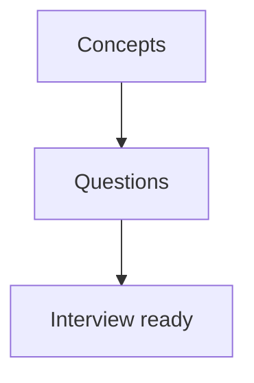

# 16 · Interview Prep

> Prepare for OpenTelemetry / observability roles: core concepts, common questions, a quick cheatsheet, and a learning path.

## Topics in this section

| Document | Summary |
|----------|---------|
| [concepts.md](concepts.md) | Must-know OTel concepts |
| [questions.md](questions.md) | Common interview questions + answers |
| [cheatsheet.md](cheatsheet.md) | Quick recall reference |
| [learning-path.md](learning-path.md) | Zero-to-OTel expert path |
| [glossary.md](glossary.md) | Terms & acronyms |

See the [main README](../README.md) for the full map.
