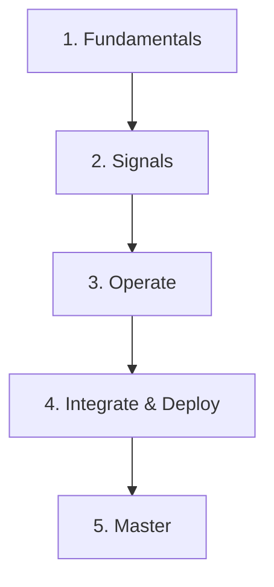

# Learning Path

## What It Is
A structured **zero-to-OTel-expert** path through this repository.

## Phases

### Phase 1 — Fundamentals
- [What is OpenTelemetry](../01-core-concepts/what-is-opentelemetry.md)
- [Signals](../01-core-concepts/signals.md) · [OTLP](../01-core-concepts/otlp.md)
- [API vs SDK](../01-core-concepts/api-vs-sdk.md)

### Phase 2 — The Signals
- [Traces](../03-traces/README.md) → [Metrics](../04-metrics/README.md) → [Logs](../05-logs/README.md)

### Phase 3 — Operate
- [Collector Pipeline](../02-architecture/collector-pipeline.md)
- [Receivers/Processors/Exporters](../02-architecture/README.md)
- [Sampling](../02-architecture/sampling.md)

### Phase 4 — Integrate & Deploy
- [Instrumentation](../08-instrumentation/README.md) · [Language SDKs](../09-language-sdks/README.md)
- [Semantic Conventions](../11-semantic-conventions/README.md)
- [Kubernetes Deployment](../13-kubernetes-deployment/README.md)

### Phase 5 — Master
- [Observability Practice](../14-observability-practice/README.md)
- [Troubleshooting](../15-troubleshooting/README.md)
- [Profiling](../12-profiling/README.md) · [Company Cases](../17-company-cases/README.md)

## Best Practices
- Run the [OpenTelemetry Demo](../14-observability-practice/opentelemetry-demo.md) early
- Build a Collector config by hand
- Practice the [Interview Questions](questions.md)

## Related Concepts
- [Concepts](concepts.md)
- [Cheatsheet](cheatsheet.md)
