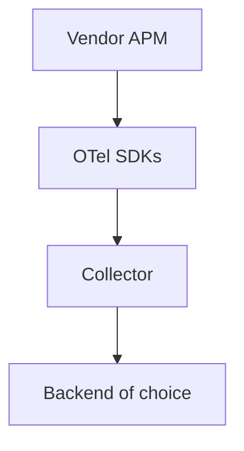

# 17 · Company Cases

> How organizations **adopt OpenTelemetry**: migrations from vendor agents, unified pipelines, lessons learned, and example case studies.

## Topics in this section

| Document | Summary |
|----------|---------|
| [adoption.md](adoption.md) | Why companies adopt OTel |
| [migrations.md](migrations.md) | Moving off vendor SDKs |
| [lessons-learned.md](lessons-learned.md) | Common pitfalls & wins |
| [case-ecommerce.md](case-ecommerce.md) | Example: large e-commerce |
| [case-fintech.md](case-fintech.md) | Example: fintech reliability |
| [case-platform.md](case-platform.md) | Example: internal platform team |

> These are **illustrative/representative** cases based on common OTel adoption patterns, not official company disclosures.

See the [main README](../README.md) for the full map.
