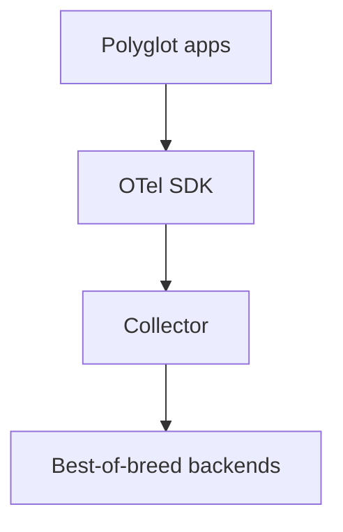

# Why Companies Adopt OpenTelemetry

## What It Is
The primary **drivers** behind enterprise OTel adoption.

## Why It Exists
Understanding motivation helps justify and scope an OTel rollout.

## Drivers
| Driver | Benefit |
|--------|---------|
| **Avoid vendor lock-in** | One SDK, swap backends freely |
| **Unified signals** | Traces + metrics + logs in one pipeline |
| **Cost control** | Collector-side sampling/routing |
| **Standardization** | Consistent telemetry across teams/langs |
| **Future-proofing** | CNCF graduated, industry standard |

## Architecture (target)

## When to Use It
- Justifying a platform observability investment
- Building an internal OTel standard

## Related Concepts
- [Migration](migrations.md)
- [Cost Control](../14-observability-practice/cost.md)
