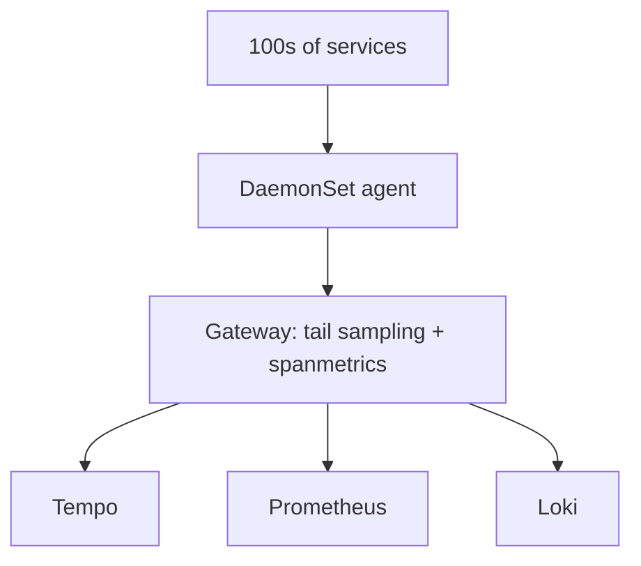

# Case Study: Large E-Commerce

> *Illustrative case based on common OTel adoption patterns.*

## Context
A large e-commerce platform with **hundreds of services** across Go, Java, and Node, previously on a single vendor APM with rising costs and limited trace/log correlation.

## Goal
Reduce cost, unify telemetry, and gain cross-service tracing for checkout flows.

## Approach

- Adopted OpenTelemetry Operator on Kubernetes
- Auto-instrumentation injection via `Instrumentation` CR
- Gateway with tail sampling (keep 100% errors + 10% rest)
- `spanmetrics` connector for instant RED dashboards
- Loki + Tempo + Prometheus (Grafana LGTM)

## Outcomes
- ~40% reduction in observability spend via sampling
- Unified trace↔log correlation cut MTTR
- Standard dashboards reusable across teams

## Lessons
- Invest in semantic conventions early
- Monitor the Collector before scaling

## Related Concepts
- [Kubernetes Deployment](../13-kubernetes-deployment/README.md)
- [Cost Control](../14-observability-practice/cost.md)
