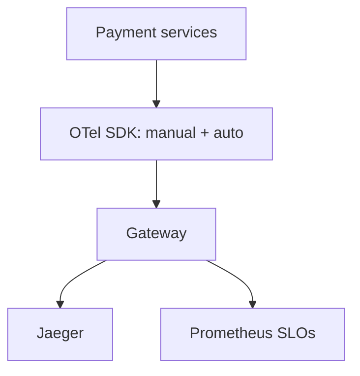

# Case Study: Fintech Reliability

> *Illustrative case based on common OTel adoption patterns.*

## Context
A fintech needed **strict reliability and auditability** for payment flows, with roots in a mix of homegrown metrics and a legacy tracing tool.

## Goal
End-to-end tracing of payment requests with error retention and SLOs.

## Approach

- Manual spans for critical payment steps + auto for frameworks
- Tail sampling prioritizing ERROR + high-latency
- SLOs on success rate and p99 latency from RED metrics
- Exemplars linking latency spikes to traces

## Outcomes
- Faster root cause during incidents (trace→log→profile)
- Clear SLO dashboards for leadership
- No vendor lock-in for future backend choices

## Lessons
- Keep 100% of errors — non-negotiable for finance
- Validate exemplars work before relying on them

## Related Concepts
- [SLOs](../14-observability-practice/slos.md)
- [Incident Response](../14-observability-practice/incident-response.md)
