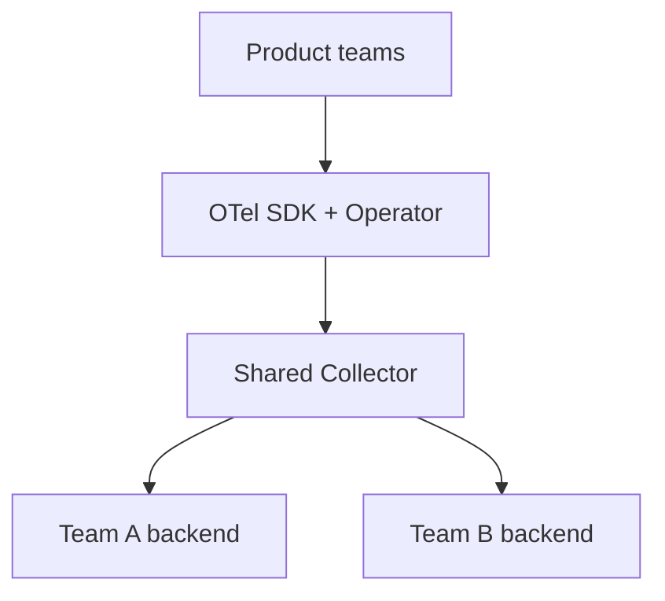

# Case Study: Internal Platform Team

> *Illustrative case based on common OTel adoption patterns.*

## Context
A platform team serving **dozens of product teams** wanted a self-serve observability standard without forcing a specific backend.

## Goal
Provide one instrumentation standard; let teams choose their backend.

## Approach

- Published an `Instrumentation` CR as the org default
- Shared Collector with routing by namespace/team
- Semantic conventions enforced via CI lint
- Collector metrics monitored centrally

## Outcomes
- Product teams onboarded in minutes via injection
- Freedom to use different backends per team
- Central visibility into telemetry health

## Lessons
- Central Collector + per-team exporters scaling
- Governance on semantic conventions pays off

## Related Concepts
- [Operator](../13-kubernetes-deployment/operator.md)
- [Semantic Conventions](../11-semantic-conventions/README.md)
