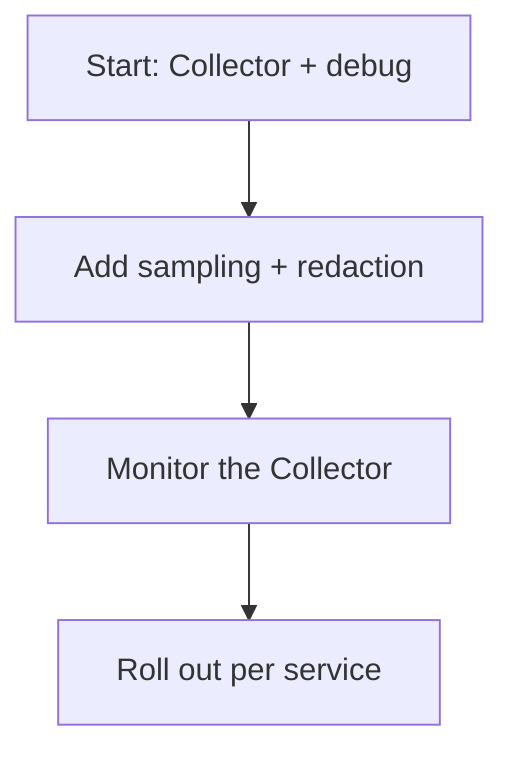

# Lessons Learned

## What It Is
Recurring **lessons** from real OpenTelemetry adoptions.

## Why It Exists
Learning from others' mistakes shortens your own rollout.

## Wins
- Unified pipeline reduced toil and onboarding time
- Collector-side sampling cut backend cost significantly
- Standard semantic conventions enabled cross-team dashboards

## Pitfalls
| Pitfall | Lesson |
|---------|--------|
| No `memory_limiter` | OOM in production on day one |
| High-cardinality attributes | Prometheus cost spike |
| Forgot to keep errors | Tail sampling dropped incidents |
| Double instrumentation | Duplicated spans; pick one mechanism |
| No Collector monitoring | Silent data loss went unnoticed |

## Recommendations

## Best Practices
- Monitor the Collector from day one
- Keep 100% of errors via tail sampling
- Control cardinality before scaling

## Related Concepts
- [Troubleshooting](../15-troubleshooting/README.md)
- [Cost Control](../14-observability-practice/cost.md)
