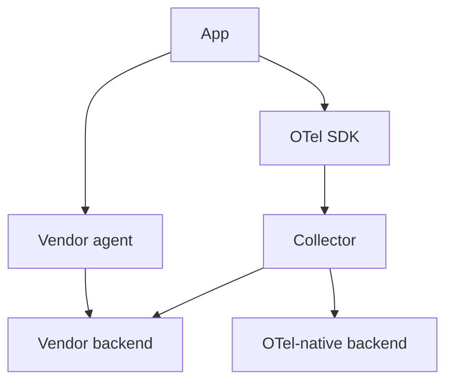

# Migrations from Vendor SDKs

## What It Is
A pattern for moving from a **proprietary APM agent** (Datadog, New Relic, Jaeger client) to OpenTelemetry.

## Why It Exists
Most migrations happen incrementally to avoid risk and downtime.

## Strangler Pattern

1. Deploy Collector alongside existing pipeline
2. Add OTel SDK (dual-emit during transition)
3. Validate dashboard/alert parity
4. Cut over exporters to OTel backend
5. Remove vendor agent

## Common Challenges
| Challenge | Mitigation |
|-----------|------------|
| Attribute name drift | Adopt semantic conventions first |
| Cost during dual-emit | Sample in transition |
| Agent conflicts | Remove the other agent before OTel |

## Best Practices
- Migrate service-by-service
- Use Collector exporters to mirror to old backend
- Keep a rollback (vendor agent) until parity proven

## Related Concepts
- [Adoption](adoption.md)
- [Datadog exporter](../10-exporters-backends/datadog.md)
