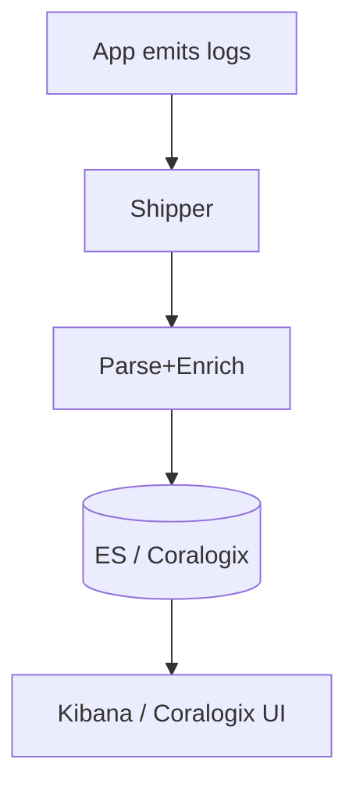

# 18 · Logging Essentials

> The **foundation of logging**: structured vs unstructured logs, levels, formats, shipping agents, parsing, enrichment, indexing, retention, and cost. This is the conceptual base for the Kibana and Coralogix sections.

## Topics in this section

| Document | Summary |
|----------|---------|
| [structured-logging.md](structured-logging.md) | JSON/key-value logs vs plain text |
| [log-levels.md](log-levels.md) | TRACE→FATAL and when to use each |
| [log-formats.md](log-formats.md) | JSON, logfmt, plain, NDJSON |
| [centralized-logging.md](centralized-logging.md) | Why aggregate logs centrally |
| [log-shipping.md](log-shipping.md) | How logs move to backends |
| [agents.md](agents.md) | Fluent Bit, Fluentd, Filebeat, Vector |
| [parsing.md](parsing.md) | Turning text into fields |
| [enrichment.md](enrichment.md) | Adding context (k8s, geo, env) |
| [indexing.md](indexing.md) |Indexes, data streams, sharding |
| [retention.md](retention.md) | Lifecycle & tiering |
| [log-cost.md](log-cost.md) | Controlling logging spend |

See the [main README](../README.md) for the full map.
