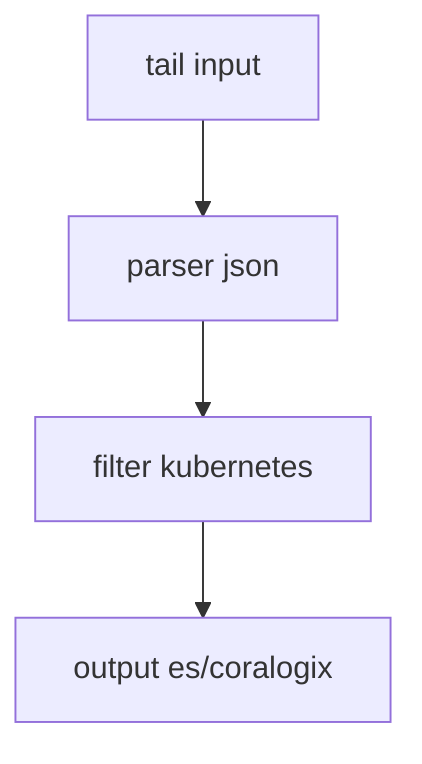

# Logging Agents

## What It Is
**Agents** collect, parse, buffer, and forward logs. The main players: **Fluent Bit, Fluentd, Filebeat/Elastic Agent, and Vector**.

## Why It Exists
A dedicated, lightweight agent offloads transport from applications and provides uniform parsing/enrichment.

## Comparison
| Agent | Strengths | Best for |
|-------|-----------|----------|
| **Fluent Bit** | Tiny, fast, C | K8s DaemonSet, edge |
| **Fluentd** | Ruby plugins, flexible | Complex routing |
| **Filebeat / Elastic Agent** | Native Elastic, ECS | Elastic Stack |
| **Vector** | High-perf, transforms | Cost/perf-critical |

## Architecture (Fluent Bit example)

## When to Use It
- **Kubernetes**: Fluent Bit DaemonSet (light) → backend
- **Elastic-native**: Elastic Agent / Filebeat
- **Transform-heavy**: Vector or Fluentd

## Best Practices
- Parse at the agent (JSON) to avoid backend parse load
- Enrich with k8s metadata
- Buffer + retry; monitor agent health
- Avoid double agents (pick one per source)

## Related Concepts
- [Parsing](parsing.md)
- [Enrichment](enrichment.md)
- [Kibana Beats](../19-kibana-elastic/beats.md)
