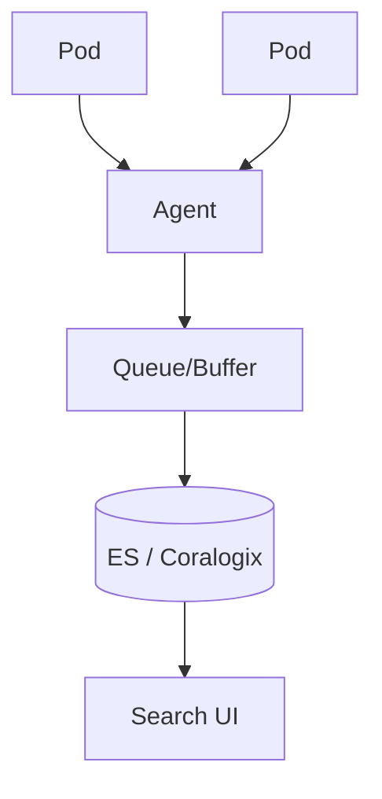

# Centralized Logging

## What It Is
**Centralized logging** aggregates logs from all services/hosts into a single searchable backend (Elasticsearch/Kibana or Coralogix) instead of per-host files.

## Why It Exists
In distributed systems, logs scatter across many pods/nodes. Centralization makes them queryable, correlatable, and retained consistently.

## Architecture

## Benefits
- Single query across all services
- Correlation via `trace_id`/`service`
- Consistent retention & access control
- Alerting on log patterns

## When to Use It
- Any multi-service / k8s environment
- Compliance & audit needs

## Best Practices
- Ship via an agent (Fluent Bit/Filebeat/Vector)
- Buffer at the agent (avoid loss on backend outage)
- Correlate with traces via `trace_id`
- Control volume (sampling, level filtering)

## Related Concepts
- [Log Shipping](log-shipping.md)
- [Agents](agents.md)
- [Kibana](../19-kibana-elastic/README.md) · [Coralogix](../20-coralogix/README.md)
