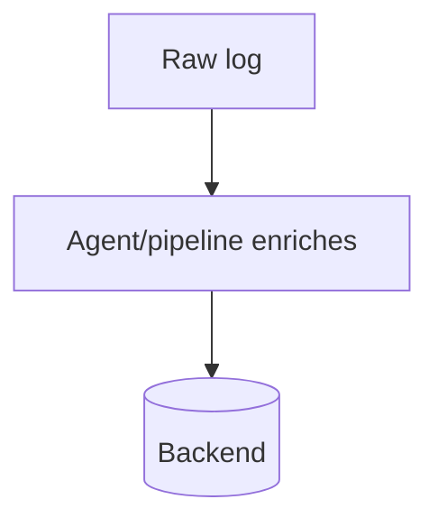

# Log Enrichment

## What It Is
**Enrichment** adds context to logs after emission — k8s metadata, geo/IP, environment, tenant, or trace linkage.

## Why It Exists
Raw app logs lack operational context (which pod/node/namespace?). Enrichment makes logs filterable by infra dimensions.

## Common Enrichments
| Enrichment | Source |
|------------|--------|
| `kubernetes.*` (pod/ns/node) | K8s API / agent |
| `host.*`, `cloud.*` | host/cloud detectors |
| `trace_id` / `span_id` | OTel context |
| geo from `client.ip` | GeoIP DB |
| tenant / env | config |

## Architecture

## When to Use It
- Always add `service`, `environment`, `k8s.*`
- Add `trace_id` for correlation
- GeoIP for client IPs (security/analytics)

## Best Practices
- Enrich at the agent/pipeline, not the app
- Use `k8sattributes`-style metadata
- Keep enrichment cheap (avoid blocking calls)

## Related Concepts
- [Agents](agents.md)
- [OTel K8s Conventions](../11-semantic-conventions/k8s.md)
- [Ingest Pipelines (Kibana)](../19-kibana-elastic/ingest-pipelines.md)
