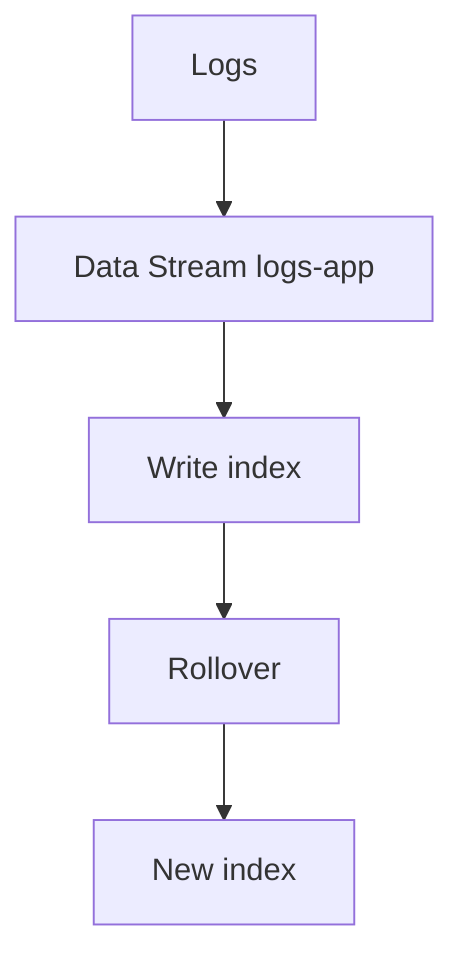

# Indexing & Data Streams

## What It Is
How log documents are stored and organized — **indexes** (Elasticsearch) or **data streams** (time-based, ILM-managed) — for efficient search and lifecycle.

## Why It Exists
Naive single-index logging causes unbounded growth and slow queries. Time-based, streamed indexing enables retention, rollover, and performance.

## Concepts
| Concept | Meaning |
|---------|---------|
| Index | A logical store of documents |
| Data stream | Time-series alias with rollover |
| Shard | Horizontal partition of an index |
| Mapping | Schema (field types) |
| Rollover | Create new index when size/age threshold hit |

## Architecture

## When to Use It
- Always use data streams for logs in Elasticsearch
- Use ILM to manage rollover/retention

## Best Practices
- One data stream per log type/service family
- Set mappings (keyword vs text) to control cost
- Avoid dynamic mapping blowup (too many fields)

## Related Concepts
- [Retention](retention.md)
- [ILM (Kibana)](../19-kibana-elastic/ilm.md)
- [Data Streams (Kibana)](../19-kibana-elastic/data-streams.md)
