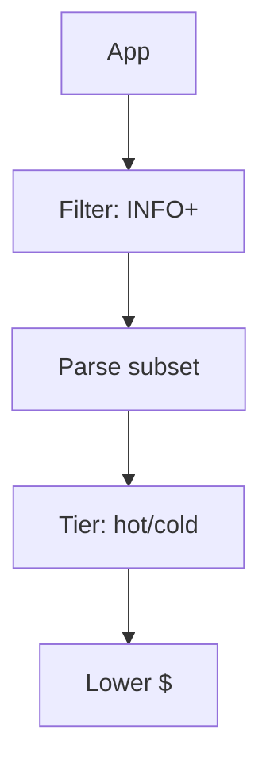

# Logging Cost Control

## What It Is
Strategies to keep **logging spend** under control — volume, parsing, retention, and tiering.

## Why It Exists
Logging is often the largest observability cost line. Unmanaged verbose logs + full indexing = surprise bills.

## Levers
| Lever | Effect |
|-------|--------|
| Level filtering | Drop DEBUG in prod |
| Sampling | Keep 1/N of verbose logs |
| Field limits | Don't index every field |
| Parse selectively | Index only queried fields |
| Retention/tiering | Hot short, cold long |
| TCO optimization | (Coralogix) index less, alert more |

## Architecture

## Best Practices
- Filter at the agent before shipping
- Use data streams + ILM (Elastic) or TCO (Coralogix)
- Monitor ingested GB/day and alert on spikes
- Correlate cost with value (alert-worthy logs indexed)

## Related Concepts
- [Retention](retention.md)
- [Coralogix TCO](../20-coralogix/tco-optimizer.md)
- [Log Levels](log-levels.md)
