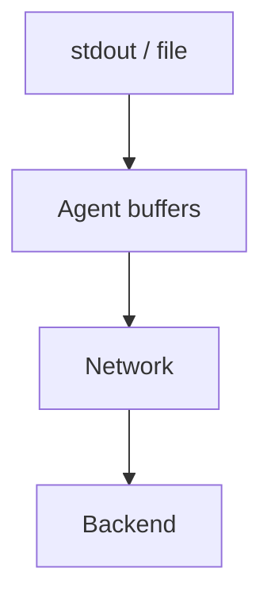

# Log Shipping

## What It Is
**Log shipping** is moving logs from where they're produced to where they're stored/searched — typically via an agent with buffering and backpressure.

## Why It Exists
Apps shouldn't block on log transport; a dedicated shipper buffers, batches, and retries so logs survive backend outages.

## Flow

## Shipping Patterns
| Pattern | Use |
|---------|-----|
| **Agent per node** (DaemonSet) | K8s, tails container logs |
| **Sidecar** | Per-pod, strict isolation |
| **Direct SDK/OTel** | App pushes OTLP logs |
| **Syslog/forward** | Legacy systems |

## Best Practices
- Buffer at the agent (disk or memory) to survive outages
- Use backpressure; drop oldest if buffer full (configurable)
- Secure transport (TLS) to the backend
- Tag with environment/service at the source

## Related Concepts
- [Agents](agents.md)
- [Centralized Logging](centralized-logging.md)
- [Log Cost](log-cost.md)
