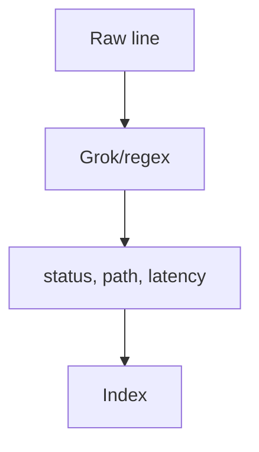

# Parsing Logs

## What It Is
**Parsing** converts raw log text into structured **fields** (e.g., extract `status_code`, `path`, `latency` from a line) so they can be filtered/aggregated.

## Why It Exists
Unparsed logs are just text; parsing unlocks field-level search, dashboards, and alerts.

## Approaches
| Approach | Where | Example |
|----------|-------|---------|
| App emits JSON | Source | best (no parsing needed) |
| Grok / dissect | Ingest pipeline (ES) | `%{NUMBER:status}` |
| Agent parser | Fluent Bit `parsers.conf` | json / regex |
| Coralogix parsing rules | Platform | UI-defined extractions |

## Example (Grok)
```
%{TIMESTAMP_ISO8601:ts} %{LOGLEVEL:level} %{DATA:msg}
```

## Architecture


## Best Practices
- Prefer structured emission (skip parsing)
- Parse at the edge (agent) when possible
- Test grok patterns before prod
- Don't over-parse (only fields you query)

## Related Concepts
- [Structured Logging](structured-logging.md)
- [Ingest Pipelines (Kibana)](../19-kibana-elastic/ingest-pipelines.md)
- [Coralogix Parsing](../20-coralogix/parsing-rules.md)
