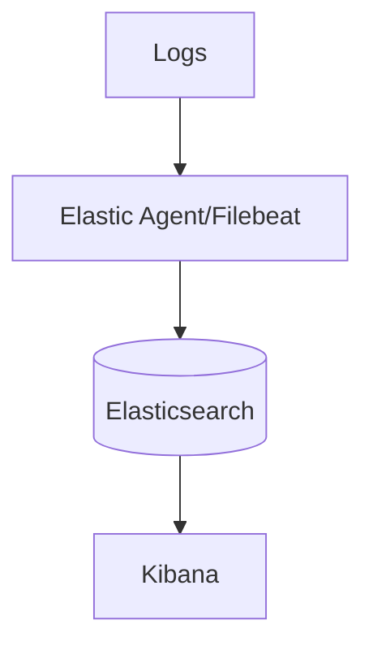

# 19 · Kibana & the Elastic Stack

> **Kibana** is the visualization layer of the **Elastic Stack** (Elasticsearch + Kibana + Beats/Elastic Agent + Logstash). This section covers logging on Elastic: ECS, Discover, dashboards, alerts, ILM, data streams, ingest pipelines, Fleet, and ingesting OTLP.

## Topics in this section

| Document | Summary |
|----------|---------|
| [elasticsearch.md](elasticsearch.md) | The search/index engine |
| [kibana-ui.md](kibana-ui.md) | Discover, Dashboards, Maps |
| [ecs.md](ecs.md) | Elastic Common Schema |
| [discover.md](discover.md) | Searching logs in Discover |
| [dashboards-visualizations.md](dashboards-visualizations.md) | Building visualizations |
| [alerts.md](alerts.md) | Stack / log-based alerts |
| [ilm.md](ilm.md) | Index Lifecycle Management |
| [data-streams.md](data-streams.md) | Time-series log streams |
| [ingest-pipelines.md](ingest-pipelines.md) | Parse/enrich at ingest |
| [beats.md](beats.md) | Filebeat, Metricbeat, etc. |
| [elastic-agent-fleet.md](elastic-agent-fleet.md) | Centralized agent management |
| [otlp-in-elastic.md](otlp-in-elastic.md) | Ingest OpenTelemetry logs/traces |
| [integrations.md](integrations.md) | Elastic integrations catalog |

See the [main README](../README.md) for the full map.
