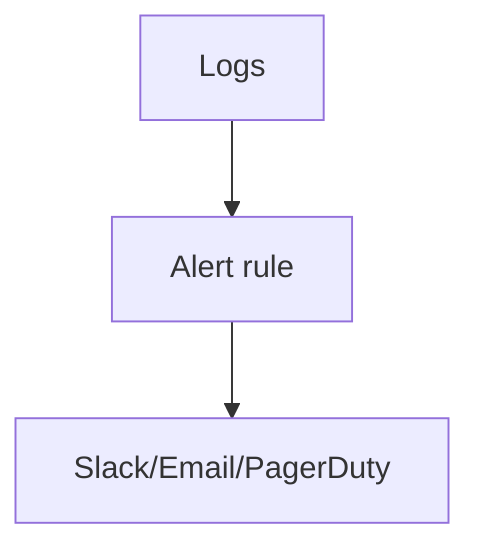

# Alerts (Elastic)

## What It Is
**Elastic alerts** fire notifications when a query/threshold on logs (or metrics) is breached — e.g., "ERROR rate > 5/min for 5m."

## Why It Exists
Logs are only useful if someone is paged when something breaks. Alerting turns log patterns into actionable notifications.

## Alert Types
| Type | Trigger |
|------|---------|
| Threshold | count of matching docs |
| Anomaly (ML) | statistically unusual |
| Geo | concentration by location |
| Rule (custom query) | KQL/Lucene match |

## Architecture

## When to Use It
- Page on error-rate spikes
- Alert on security patterns (auth failures)
- Anomaly detection on latency-from-logs

## Best Practices
- Alert on symptoms (error rate), not single lines
- Use action connectors (Slack, PagerDuty, webhook)
- De-duplicate; avoid alert storms
- Pair with log-based SLOs

## Related Concepts
- [Discover](discover.md)
- [Log-based SLOs (practice)](../21-log-observability-practice/log-based-slos.md)
- [Alerting (OTel)](../14-observability-practice/alerting.md)
