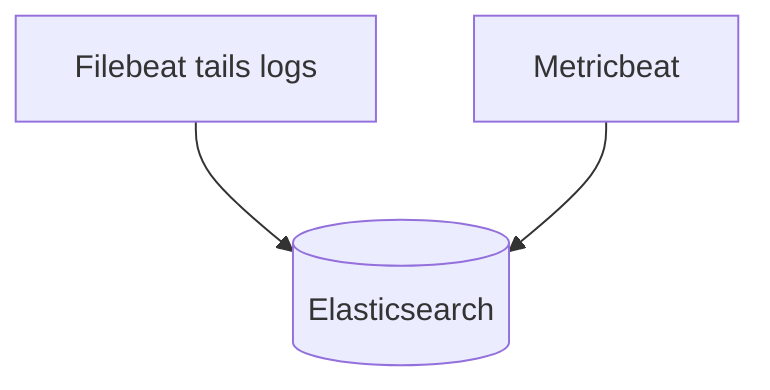

# Beats

## What It Is
**Beats** are lightweight Elastic data shippers: **Filebeat** (logs), **Metricbeat** (metrics), **Packetbeat** (network), etc.

## Why It Exists
Beats are the original way to get logs/metrics into Elastic efficiently, with modules that pre-configure parsing and dashboards.

## Common Beats
| Beat | Data |
|------|------|
| **Filebeat** | Log files → ES/Kibana |
| **Metricbeat** | System/app metrics |
| **Packetbeat** | Network flows |
| **Auditbeat** | Audit/security events |
| **Heartbeat** | Uptime monitoring |

## Architecture

## When to Use It
- Lightweight single-purpose shipping
- Filebeat modules for nginx, system, etc.

## Best Practices
- Prefer **Elastic Agent** for new deployments (unified)
- Use modules to auto-map to ECS + dashboards
- Buffer/backoff on backend outages

## Related Concepts
- [Agents (essentials)](../18-logging-essentials/agents.md)
- [Elastic Agent & Fleet](elastic-agent-fleet.md)
