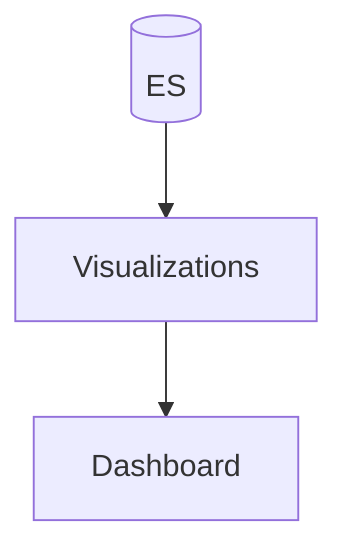

# Dashboards & Visualizations

## What It Is
**Dashboards** in Kibana combine saved **visualizations** (bar charts, tables, maps, heatmaps) of your logs/metrics for at-a-glance monitoring.

## Why It Exists
Raw logs answer "what happened"; dashboards answer "is the system healthy right now?" and trend over time.

## Visualization Types
| Type | Use |
|------|-----|
| Bar/line | Error counts over time |
| Data table | Top error messages |
| Heatmap | Traffic by hour/service |
| Maps | Geo of client IPs |
| Tag cloud | Frequent log messages |

## Architecture

## When to Use It
- Per-service log overview
- Error-rate / latency-from-logs panels
- On-call landing pages

## Best Practices
- Build from saved searches
- Use ECS fields so dashboards are reusable
- Add filters (env/service) for drill-down
- Combine with metrics/traces dashboards

## Related Concepts
- [Kibana UI](kibana-ui.md)
- [Alerts](alerts.md)
- [Log-based SLOs (practice)](../21-log-observability-practice/log-based-slos.md)
