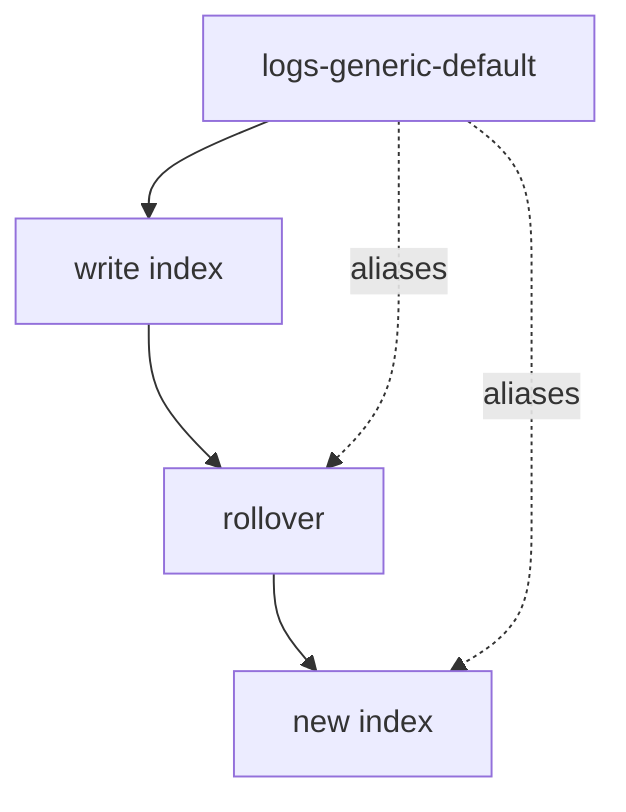

# Data Streams

## What It Is
An Elasticsearch **data stream** is a time-series abstraction (backed by multiple indices) with built-in rollover and ILM — the recommended way to store logs/metrics/traces.

## Why It Exists
Data streams solve the "one giant index" anti-pattern: they auto-rollover, keep writes on hot nodes, and integrate with ILM seamlessly.

## Structure

- Named `type-dataset-namespace` (e.g., `logs-nginx-access-default`)
- Backed by a composable index template + ILM

## When to Use It
- All log ingestion in Elastic
- Required for Fleet/Elastic Agent integrations

## Best Practices
- Follow `logs-<dataset>-<namespace>` naming
- Bind an ILM policy via the index template
- Use the right `data_stream.type` (logs/metrics/traces)

## Related Concepts
- [ILM](ilm.md)
- [Elastic Agent & Fleet](elastic-agent-fleet.md)
- [Indexing (essentials)](../18-logging-essentials/indexing.md)
