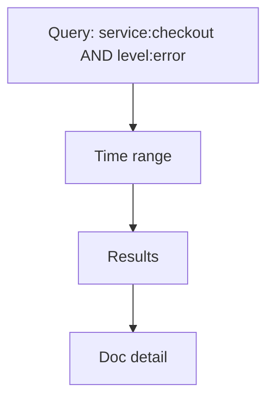

# Discover

## What It Is
**Discover** is Kibana's log exploration view — write a query (KQL/Lucene), pick a time range, and inspect matching documents field-by-field.

## Why It Exists
Investigating incidents means "show me the logs for service X with errors in the last 10 minutes." Discover is purpose-built for that.

## Anatomy


## Common Queries (KQL)
```
service.name: checkout and log.level: error
url.path: "/pay" and response.status_code >= 500
trace.id: "abc123"
```

## When to Use It
- Incident triage
- Ad-hoc investigation
- Building filters to save as dashboards

## Best Practices
- Always scope a time range
- Use `trace.id` to jump from a trace to its logs
- Save useful queries/filters for reuse
- Expand a document to see all ECS fields

## Related Concepts
- [Kibana UI](kibana-ui.md)
- [Alerts](alerts.md)
- [KQL/Lucene (practice)](../21-log-observability-practice/query-languages.md)
