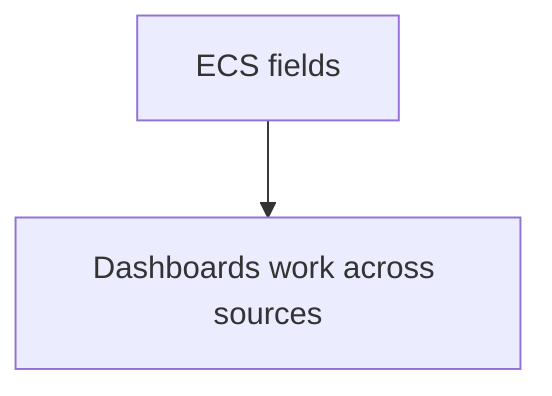

# Elastic Common Schema (ECS)

## What It Is
**ECS** is Elastic's **standard field naming schema** for events (logs, metrics, traces) — e.g., `event.kind`, `host.name`, `service.name`, `error.message`.

## Why It Exists
Without a schema, every team names fields differently (`host` vs `server` vs `node`), breaking cross-source dashboards. ECS creates a shared vocabulary, just like OTel semantic conventions.

## Key Fields
| Field | Meaning |
|-------|---------|
| `service.name` | Service producing the event |
| `host.name` | Host |
| `event.kind` | `event` / `metric` / `alert` |
| `event.dataset` | e.g., `nginx.access` |
| `error.message` | Error text |
| `trace.id` / `span.id` | Correlation |
| `log.level` | log severity |
| `message` | The log line |

## Architecture

## When to Use It
- Always map logs to ECS
- OTel → ECS mapping exists for Elastic ingest

## Best Practices
- Adopt ECS at ingest (Elastic Agent / OTel mapping)
- Align with OTel semantic conventions where possible
- Use `trace.id` for log-trace correlation

## Related Concepts
- [OTel Semantic Conventions](../11-semantic-conventions/README.md)
- [Ingest Pipelines](ingest-pipelines.md)
- [OTLP in Elastic](otlp-in-elastic.md)
