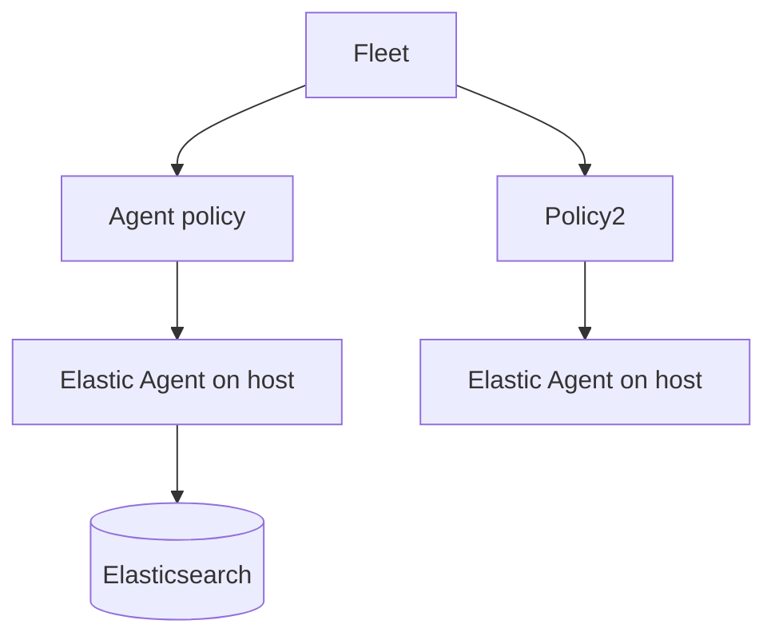

# Elastic Agent & Fleet

## What It Is
**Elastic Agent** is the unified, lightweight agent that replaces Beats, and **Fleet** is its centralized management plane (policies, enrollment, upgrades).

## Why It Exists
Managing many Beat configs is toil. Elastic Agent + Fleet give one agent, one policy, centrally managed — including log shipping, system integration, and OTel collection.

## Architecture

## Key Features
- **Integrations** (turn-key: nginx, k8s, aws, system)
- **Policies** pushed to agents
- **Centralized upgrade / config**
- **OTel collector** mode built-in

## When to Use It
- New Elastic deployments
- Centralized, GitOps-friendly agent management

## Best Practices
- Use Fleet-managed agents (not standalone)
- Roll out via Kubernetes DaemonSet (Elastic Agent)
- Combine integrations + custom log inputs

## Related Concepts
- [Beats](beats.md)
- [Integrations](integrations.md)
- [OTLP in Elastic](otlp-in-elastic.md)
