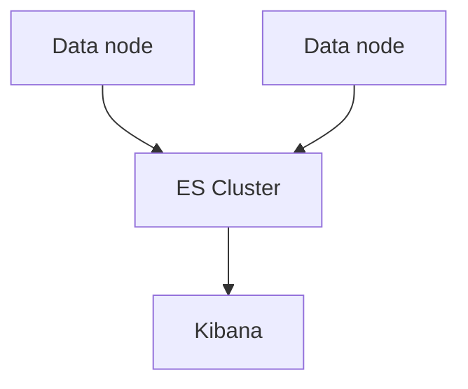

# Elasticsearch

## What It Is
**Elasticsearch** is a distributed, RESTful **search and analytics engine** that stores and indexes log documents for fast full-text and field queries.

## Why It Exists
Centralized logging needs a store that can ingest high-volume time-series data and answer complex queries in milliseconds. Elasticsearch does that via inverted indexes + columnar (doc values).

## Key Concepts
| Concept | Meaning |
|---------|---------|
| Index / Data Stream | Logical store of documents |
| Document | One log record (JSON) |
| Shard | Horizontal partition |
| Inverted index | Enables full-text search |
| Mapping | Field types (keyword vs text) |
| Query DSL | JSON-based query language (Lucene/KQL) |

## Architecture

## When to Use It
- Central log storage & search
- Dashboards, alerts, ML anomalies via Kibana

## Best Practices
- Use data streams for logs (with ILM)
- Set explicit mappings; avoid mapping explosion
- Right-size shards (~10–50 GB each)

## Related Concepts
- [Data Streams](data-streams.md)
- [ILM](ilm.md)
- [Kibana UI](kibana-ui.md)
