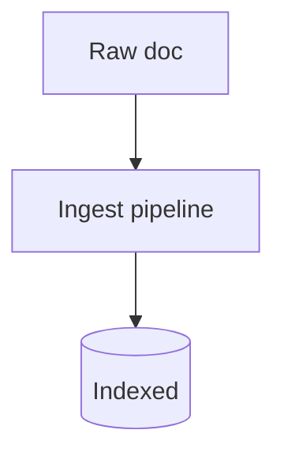

# Ingest Pipelines

## What It Is
**Ingest pipelines** are server-side processors in Elasticsearch that **parse, enrich, and transform** documents at index time (before they're stored).

## Why It Exists
Move parsing/enrichment off the agent and into Elastic where it's centralized and versioned. Great for grok, dissect, geoip, and ECS mapping.

## Common Processors
| Processor | Use |
|-----------|-----|
| `grok` / `dissect` | Extract fields from text |
| `json` | Parse JSON strings |
| `geoip` | IP → geo fields |
| `date` | Parse timestamps |
| `rename` / `set` | Map to ECS |
| `drop` / `fail` | Filter bad docs |
| `enrich` | Add data from another index |

## Example
```json
{ "description": "parse nginx", "processors": [
  { "grok": { "field": "message", "patterns": ["%{IPORHOST:source.ip} %{DATA:user} ..."] } },
  { "geoip": { "field": "source.ip" } }
] }
```

## Architecture


## Best Practices
- Keep heavy parsing in pipelines, not agents
- Test with `_ingest/_simulate`
- Map to ECS for reusable dashboards
- Avoid dropping too much silently (log failures)

## Related Concepts
- [Parsing (essentials)](../18-logging-essentials/parsing.md)
- [ECS](ecs.md)
- [Data Streams](data-streams.md)
